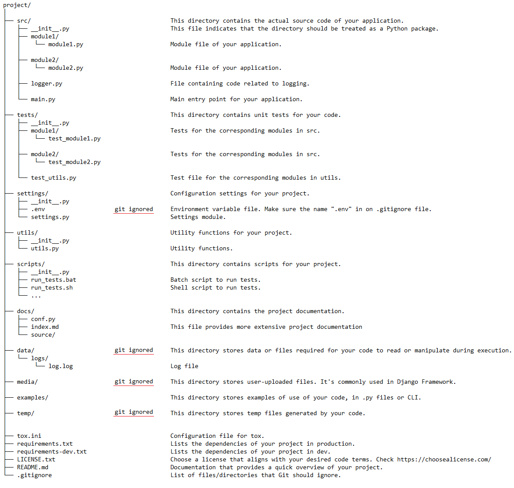

Python Project Template
=======================================

Description
---------------

This is a template for a Python project with basic directories and file examples.

## Structure




## How to use this Python Project Template

## ON PRODUCTION

### .env file

Take a look at the .env.example file and implement your own .env file.

The .env file is often used to store environment variables with sensitive information that should not be included directly in the source code. Store sensitive data and settings in this file that others outside the local scope should not have access to. Example: API keys, passwords, access tokens, URL of a development, test, or production database, etc.

Make sure the name ".env" in on your .gitignore file.

### dotenv library

The dotenv library is used to load the .env file for the environment variables so that they can be captured by the system.
This library is used in the settings.py file, where you can find an example of its use.

### Logging

This project includes a configured log file. We use the built-in logging library to generate logs.
Logs are written to the data/logs folder.
You can check examples of logging usage in the src/ folder.

## ON DEVELOPMENT

## Tests and Code Quality

This project includes an automation tool (already configured) called [tox](https://github.com/tox-dev/tox) to run:

- Tests ([pytest](https://github.com/pytest-dev/pytest), [pytest-cov](https://github.com/pytest-dev/pytest-cov) and [radon](https://github.com/rubik/radon))
- Code Formatters ([blue](https://github.com/grantjenks/blue) and [isort](https://github.com/pycqa/isort))
- Linters (Code Quality Checker) ([pylint](https://github.com/pylint-dev/pylint))
- Static Typing Checker ([mypy](https://github.com/python/mypy))


[Tox](https://github.com/tox-dev/tox) is an automation tool for Python testing environments. It is used to automate common testing-related tasks such as running unit tests, code style checks, static analysis, and more in isolated environments.

You can run all tests, formatters, linter and type cheker by running the following command (run the command from the project root folder):

```bash
tox
```

You can also run them individually with the commands below:

Run all tests: standard tests (pytest), coverage tests (pytest-cov) and complexity check (radon):

```bash
tox -e testenv
```

Run code formatters (blue and isort):

```bash
tox -e format
```

Run linter (pylint):

```bash
tox -e lint
```

Run type checker (mypy):

```bash
tox -e type
```


## Tests (pytest)

You can run all tests (standard tests, coverage tests and complexity check) by running the following command (run the command from the project root folder):

On Windows:
```bash
.\scripts\run_tests.bat
```

On Linux:
```bash
.\scripts\run_tests.sh
```

The tests have 3 stages:

### Standard tests with pytest

Pytest is a library that is used to write and run unit tests simply and effectively. It offers a flexible framework for organizing tests and includes a wide range of useful features to facilitate the testing process.
Go to the tests directory where you can find an example of its use.

You can also run the standard tests with the command below (run the command from the ./tests directory):

```bash
pytest -v
```

### Coverage Tests with pytest-cov

Pytest-cov is a pytest plugin used for measuring code coverage in Python projects. It integrates seamlessly with the pytest testing framework, allowing you to collect and report code coverage information during the execution of your tests.

You can also run the coverage tests with the command below (run the command from the ./tests directory):

```bash
pytest --cov
```

### Complexity check with radon

radon is a Python library and command-line tool used for analyzing code complexity in Python projects. It provides various metrics that give insights into the complexity and maintainability of your code.

You can also run the complexity check with the command below (run the command from the .\src directory):

Execution of Cyclomatic Complexity check
```bash
radon cc -s .
```

Halstead Maintenance Index Check Execution
```bash
radon mi -s .
```

## Linter (pylint)

A linter, short for "code linter" or "source code analyzer," is a tool that analyzes source code for potential errors, stylistic issues, and other problems. The primary purpose of a linter is to enforce coding standards, identify programming errors, and improve the overall quality and consistency of the codebase.

In this project, we use pylint as a linter.
Pylint is a popular Python static code analysis tool and linter. Its main purpose is to analyze Python source code, identify potential errors, enforce coding standards, and provide feedback to developers about the quality and style of their code. 


You can run the linter check by running the following command (run the command from the project root folder):

On Windows:
```bash
.\scripts\run_linters.bat
```

On Linux
```bash
.\scripts\run_linters.sh
```

You can also run the linter check with the command below (run the command from the .\src directory):
```bash
pylint .
```

## Code formatters (isort and blue)

You can run all code formatters by running the following command (run the command from the project root folder):

On Windows:
```bash
.\scripts\run_code_format_corrections.bat
```

On Linux:
```bash
.\scripts\run_code_format_corrections.sh
```

Isort is a Python utility that helps organize and sort import statements in Python code files. It's specifically designed to automatically format import sections, ensuring a consistent and standardized order for imports. Properly organized imports contribute to code readability and maintainability.

Blue is a code formatting tool for Python. It automatically reformats Python code to adhere to a consistent style, following the guidelines of the PEP 8 style guide.

You can also run the formatters check with the command below (run the command from the .\src directory):

```bash
isort . --check
blue . --check
```

You can also run the code formatters with the command below (run the command from the .\src directory):
```bash
isort .
blue .
```

## Type checks (mypy)

The MyPy library is a static type checking tool for Python. Its main purpose is to help developers detect type errors in Python code before they even run it.

You can also run the static type checking with the command below (run the command from the .\src directory):

```bash
mypy .
```

## pip_audit
To be configured

## pre-commit
To be configured

## mkdocs
To be configured
